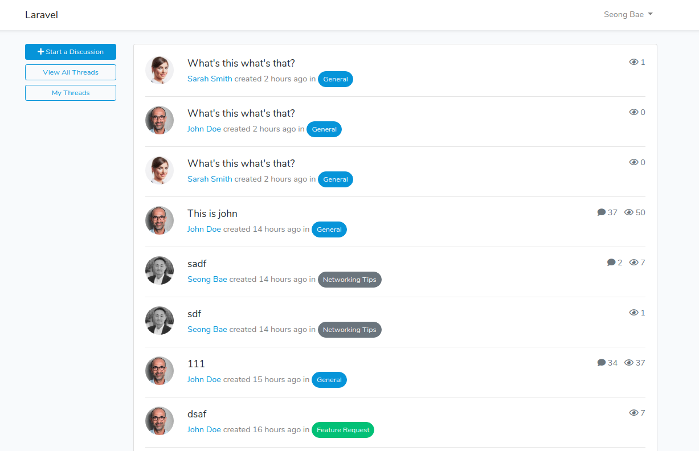

# Laravel Forum Package

[](https://packagist.org/packages/seongbae/discuss)
[](https://travis-ci.org/seongbae/discuss)
[](https://scrutinizer-ci.com/g/seongbae/discuss)
[](https://packagist.org/packages/seongbae/discuss)

This package provides discussison forum for Laravel applications.  This is based on a Laravel forum tutorial I saw a while ago.  I wanted to put it into a pacakge for re-use and add some additional features such as receiving notifications for my own needs.



## Features

* Create/edit/delete threads and replies
* Admins can edit or delete any threads or replies.
* Threads can be categorized with a channel.
* Filter threads by channels or my threads
* Subscribe to channels and get notified via email when a new thread is created in the channel.
* Subscribe to threads and get notified via email when replies are added.
* Thread view count is tracked.
* Pagination

## To Do
* Unit tests
* Sticky threads
* Tags
* Vote up/down
* Poll
* API integration

## Installation

You can install the package via composer and publish assets:

```bash
composer require seongbae/discuss
php artisan vendor:publish --provider="Seongbae\Discuss\DiscussServiceProvider"
```

When you publish files, the config/discuss.php config file will be generated.  In this file, you can set pagination count, user image field, and other various configurations for your application.

The package uses bootstrap-vue component.  Install it with following command:

```bash
npm install bootstrap-vue
```

Update your app.js to include following code:

```vue
import { BootstrapVue } from 'bootstrap-vue'
Vue.component('thread', require('./components/Thread.vue').default);
Vue.component('reply', require('./components/Reply.vue').default);
Vue.component('channel-subscribe', require('./components/ChannelSubscribe.vue').default);
Vue.use(BootstrapVue)
```

Then run npm commands:

```bash
npm install
npm run dev
```

## Usage

* After installation is complete, head over to /discuss.

### Libraries used

* sweetalert package by realrashid for displaying alerts. 
* Vue
* Bootstrap-vue

### Changelog

Please see [CHANGELOG](CHANGELOG.md) for more information what has changed recently.

## Contributing

Please see [CONTRIBUTING](CONTRIBUTING.md) for details.

### Security

If you discover any security related issues, please email seong@lnidigital.com instead of using the issue tracker.

## Credits

- [Seong Bae](https://github.com/seongbae)
- [All Contributors](../../contributors)

## License

The MIT License (MIT). Please see [License File](LICENSE.md) for more information.
